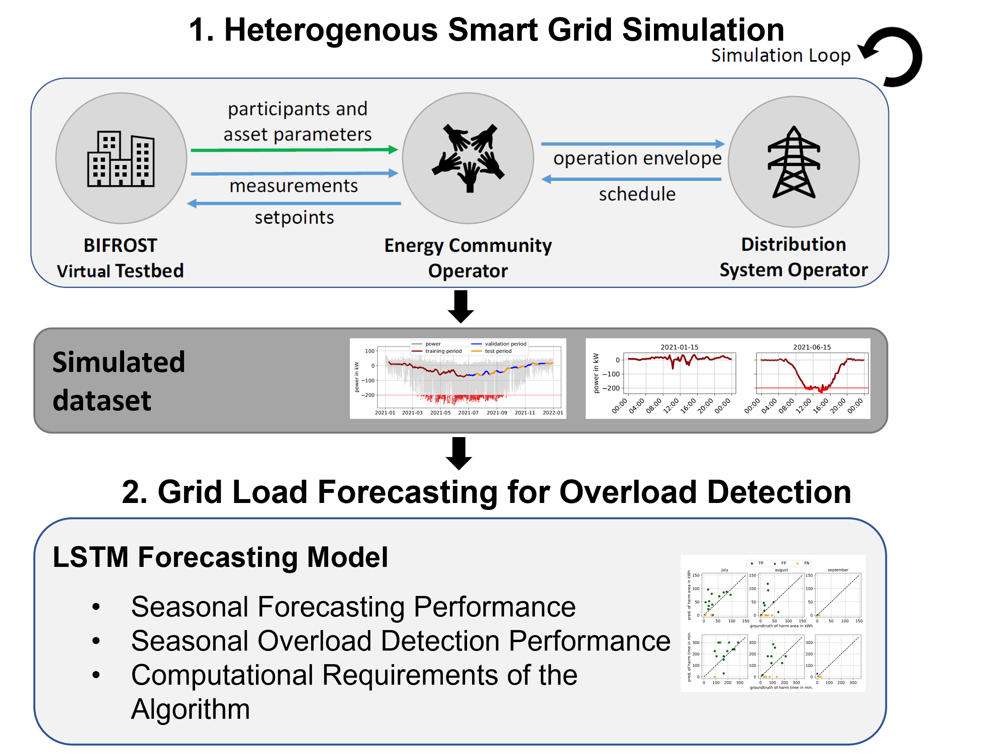

# Forecasting Critical Overloads based on Heterogeneous Smart Grid Simulation

We provide the dataset, training and validation setup.
(Install `requirements.txt` to get startet)

## Dataset 
The raw dataset and the corresponding splits can be found in `.\raw_data\final_splits`.

Credits to [ZAMG](https://data.hub.geosphere.at/) for historic weather data.

Credits to [Meteoblue](https://www.meteoblue.com) for solar irradiance forecasts.

## Training
The script `train_lstm.py` can be used to train a new model. You can specify which features to use for training.

## Evaluation
The notebook `analysis_notebook.ipynb` is used to test and evaluate all experiments which can be found in the paper. 
The pretrained models for the different experiments including the scaled train/valid/test data can be found in `.\saved_runs`

